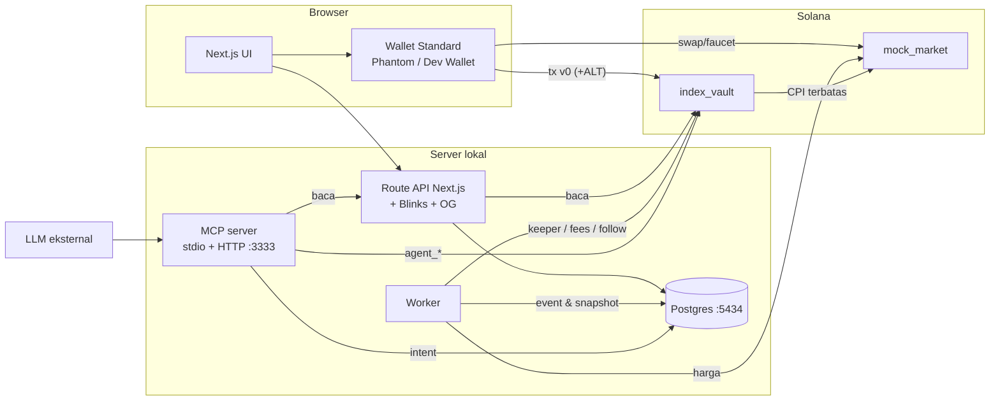

# Arsitektur

Stockbreak adalah platform index saham tokenized di Solana (localnet/devnet, semua aset simulasi). Dokumen ini menjelaskan bagian-bagian sistem dan bagaimana mereka terhubung. Rincian kontrak ada di `PLAN.md` §5–§7, keputusan di `DECISIONS.md`.

## Gambaran

## Program (Anchor, `anchor/programs`)

| Program | Isi |
|---|---|
| `index_vault` | Produk inti: `Config`, `Index` (aset, bobot target, saldo internal `AssetEntry.balance`, fee owed, strategi/mandate, manager, pending update, rebalance ticket). Instruksi: create, join/redeem in-kind, propose/apply/cancel update (timelock), set managers, pause, accrue/claim fees (Creator/Platform/Parent), flash rebalance `begin_rebalance`/`end_rebalance`, `sync_targets` (follow), `migrate_ipo`. |
| `mock_market` | Semua simulasi: oracle feed (harga + publish time), swap AMM-oracle dengan spread, faucet USDC, issuer mint Token-2022 ScaledUiAmount, event IPO. |

Prinsip keamanan (A14): checked math & pembulatan menguntungkan vault; `transfer_checked` sesuai program token mint; semua `remaining_accounts` divalidasi (urutan, mint, owner); CPI hanya ke program di `Config`; redeem tidak bisa diblokir kreator (fee dicatat sebagai owed); selama ticket rebalance aktif, instruksi index lain ditolak.

**Flash rebalance "sandwich"** (PLAN §6.3): satu transaksi `begin_rebalance → swap → transfer_checked(executor → vault) → end_rebalance`. `begin` memeriksa lewat introspeksi sysvar instruksi bahwa `end` ada di transaksi yang sama, stack height level transaksi, peran executor (creator/manager bebas trigger; keeper hanya bila trigger strategi terpenuhi dan tanpa aset pre-IPO), pause, dan cooldown. `end` memeriksa slippage terhadap `max_slippage` dan bahwa total drift tidak naik (`WrongDirection`).

**Harga saham**: token saham adalah Token-2022 dengan ekstensi ScaledUiAmount. Nilai = saldo × multiplier × harga oracle. Math identik di Rust (`anchor/crates/index_math`) dan TypeScript (`packages/sdk/src/math.ts`), dengan vektor paritas bersama.

## Paket TypeScript

| Paket | Peran |
|---|---|
| `packages/config` | Skema env (zod), registry aset, parameter per cluster, file deployment `deployments/{cluster}.json`, shock harga. |
| `packages/sdk` | Satu-satunya akses chain. Client Codama (`generated/`), builder instruksi, `sendTx` v0 + ALT, packing transaksi, zap in/out (USDC ↔ komposisi), planner rebalance (`planRebalance`, `planPair`), IPO, humanisasi error program. |
| `packages/db` | Satu-satunya akses DB. Schema Drizzle (§7.3), migrasi, semua query. Database per cluster: `app`, `app_devnet`, `app_test` (D027). |

## Aplikasi

**`apps/web`** (Next.js App Router, shadcn/ui, TanStack Query). Wallet lewat `@solana/kit-plugin-wallet` (Wallet Standard): Phantom di devnet, Dev Wallet (keypair di localStorage, terdaftar sebagai wallet standard) di localnet/devnet. Transaksi dibangun di client dengan SDK lalu ditandatangani wallet. Route API membaca DB + chain untuk angka live (NAV, bobot, drift). Blinks: `/actions.json` + `/api/actions/join/[pubkey]` (tx swap lalu `links.next` tx join). OG image per index lewat `next/og`. Halaman `/sign?id=` mengeksekusi intent dari MCP (transaksi dibangun ulang dengan blockhash baru, multi-langkah).

**`apps/worker`** (Bun, satu proses, loop independen):
- `price`: Jupiter Price v3 → Finnhub → random walk, dikali shock (`bun run price`), dipublikasikan ke oracle; feed yang belum ada (target IPO) dilewati.
- `indexer`: event program → tabel `events`, sinkron index & posisi.
- `snapshot`: NAV & share price per menit (chart, return).
- `keeper`: rebalance otomatis saat trigger strategi terpenuhi (memakai jam validator agar `warp` berlaku).
- `fees`: `accrue_fees` berkala. `follow`: `sync_targets` index follower. `gamification`: XP & badge idempoten.

**`apps/mcp`** (MCP TypeScript SDK v2): 18 tool + resource `docs://guide`. Tool baca memakai JSON API web agar angka sama dengan UI (D028). Tool `build_*` menyimpan intent di `sign_intents` dan mengembalikan link `/sign`. Tool `agent_*` aktif bila `AGENT_KEYPAIR_PATH` diset dan menandatangani dengan keypair agent; `simulate_rebalance` meniru semua pemeriksaan program lalu mensimulasikan transaksi di RPC. Transport stdio dan Streamable HTTP (127.0.0.1, validasi Host).

## Alur data utama

1. **Create**: wizard → `create_index` (ALT dibuat dulu bila ≥ 5 aset) → setoran awal lewat zap. Indexer mencatat `IndexCreated`; web menampilkan index.
2. **Join (zap)**: rencana swap USDC → tiap aset sesuai bobot (dipak ke sesedikit mungkin transaksi) → `join` in-kind dengan jumlah aktual → share token.
3. **Redeem**: `redeem` in-kind → opsional swap balik ke USDC. Selalu bisa, termasuk saat index di-pause.
4. **Rebalance**: keeper/agent/creator membangun sandwich; program menolak yang melanggar mandate.
5. **Feed (D033)**: post/like/komentar disimpan di Postgres (off-chain). Penulisan butuh sesi sign-in: satu tanda tangan pesan wallet, lalu cookie httpOnly 24 jam. Aturan anti-spam: aktivitas on-chain, batas laju, konten. Feed menggabungkan post dengan event on-chain dari indexer. Tab Following memakai `social_follows` dan posisi viewer.
6. **Follow**: perubahan bobot induk (propose → timelock → apply) disalin worker ke follower lewat `sync_targets`.
7. **IPO**: `bun run ipo` membuat mint saham baru, lalu `migrate_ipo` untuk tiap index pemegang (rasio 1:1), timeline & badge `ipo_survivor`.
8. **Fee**: management fee terakru sebagai share baru (owed) untuk kreator, platform, dan royalty induk clone; diklaim terpisah.

## Jaringan & kunci

- Localnet: Surfpool offline di 8899 (`bun run dev`), time-travel via `surfnet_timeTravel` (`bun run warp`).
- Devnet: program ter-deploy, `bun run dev:devnet` menjalankan worker/web/MCP lokal menunjuk devnet; faucet SOL ditransfer dari admin. Mainnet tidak pernah dipakai untuk transaksi (price feeder hanya membaca harga).
- Keypair di `.keys/` (gitignored) dan config CLI project `.keys/solana-cli.yml`; config Solana global tidak disentuh.

## Pengujian

| Lapisan | Alat |
|---|---|
| Program | LiteSVM (Rust), 38 test sukses + gagal per error (`bun run test:program`) |
| SDK | bun test: paritas math, humanisasi error, flow nyata di Surfpool :18899 |
| MCP | bun test klien in-process terhadap stack localnet |
| E2E | Playwright: halaman (light/dark, 375/1280), flow dev wallet, Blink/OG, MCP → `/sign`, skenario DoD §11.1 |
| Gerbang | `bun run verify` (lint, typecheck, test program, test TS, build, e2e) |
